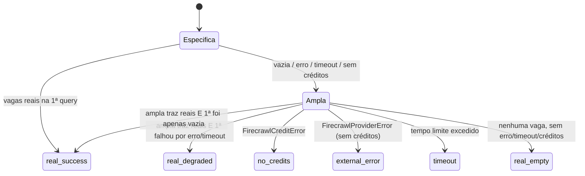
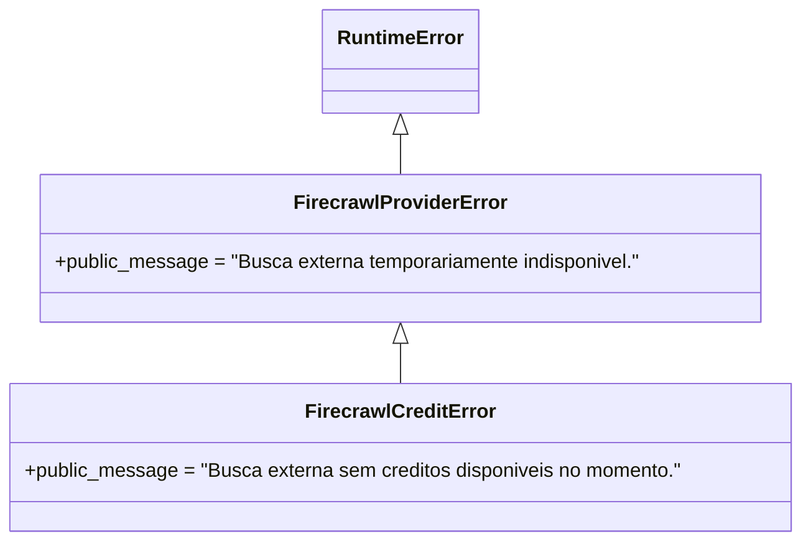

# Design Document

## Overview

Esta feature consolida e torna verificável a **proveniência (data provenance)**
dos dados exibidos pelo Recoloca IA quando o Firecrawl é usado em condições
reais. O objetivo não é reescrever a integração — o comportamento já existe em
`backend/firecrawl_client.py`, `backend/agents/scout.py`,
`backend/agents/curator.py` e `frontend/src/components/ScoutReport.tsx`. O foco
do design é **formalizar os contratos** desse comportamento (campos, estados,
marcadores e regras de link) e **fechar a malha de testes automatizados** que
impedem regressões na sinalização de origem, além de definir um **roteiro de
validação manual reproduzível** para a execução real que consome créditos.

A feature se organiza em quatro eixos, mapeados diretamente aos requisitos:

1. **Origem dos dados (provenance):** todo `job_entry` do Scout carrega um campo
   `source ∈ {real, llm, simulated}`; todo relatório carrega um
   `status_busca ∈ {real_success, real_empty, real_degraded, no_credits, external_error, timeout}`;
   o Curator distingue recurso de busca real de recomendação interna.
   (Requisitos 1, 2, 3)
2. **Registro estruturado (observabilidade):** o `Firecrawl_Client` emite logs
   JSON de sucesso/erro com `session_id` e converte falhas em
   `FirecrawlProviderError` / `FirecrawlCreditError`. (Requisito 4)
3. **Validação e normalização de artefatos:** salários, benefícios e requisitos
   das vagas (Scout); plataforma, nível, duração e preço dos cursos (Curator);
   com marcação explícita de "não informado". (Requisitos 5, 6)
4. **Abertura segura de links + cobertura de testes + validação manual:** apenas
   URLs http(s) de vagas `real` são clicáveis; testes automatizados cobrem
   origem, estado de busca, conversão de erros, normalização e links; e um
   roteiro manual versionado valida a execução real ponta a ponta.
   (Requisitos 7, 8, 9, 10, 11)

A maior parte da lógica relevante é composta de **funções puras**
(classificação, normalização, parsing de blocos, validação de URL), o que torna
parte significativa dos requisitos adequada a **testes baseados em propriedades
(PBT)**. As partes de I/O (chamadas reais ao Firecrawl, logging) são cobertas por
testes baseados em exemplo/mocks e pelo roteiro manual.

### Mapa de requisitos → componentes

| Requisito | Componente principal | Natureza |
|-----------|----------------------|----------|
| 1 — origem das vagas | `ScoutAgent._build_job_entry`, `run` | Lógica pura + montagem de relatório |
| 2 — estado de busca | `ScoutAgent.run` (máquina de estados) | Lógica de fluxo |
| 3 — origem dos cursos | `CuratorAgent.run`, `SearchOutcome` | Lógica de fluxo |
| 4 — log estruturado | `firecrawl_client.firecrawl_search/scrape` | I/O + observabilidade |
| 5 — salários/requisitos | `ScoutAgent._build_job_entry`, `_recurring_requirements` | Normalização pura |
| 6 — atributos de curso | `CuratorAgent._platform_for_url/_classify_level/_extract_duration/_price_for_platform` | Normalização pura |
| 7 — links seguros | `ScoutReport.normalizeHttpLink` (frontend) | Função pura |
| 8, 9, 10 — testes | suites pytest / vitest | Meta (existência de testes) |
| 11 — validação manual | documento versionado | Roteiro manual |

## Architecture

O fluxo de proveniência atravessa três camadas: provedor (Firecrawl_Client),
agentes (Scout/Curator) e apresentação (ScoutReport). A origem do dado é
**decidida na camada de agente** e **propagada de forma imutável** até a
apresentação, que apenas a interpreta — nunca a recalcula.

```mermaid
flowchart TD
    subgraph Provider[Firecrawl_Client]
        FS[firecrawl_search / firecrawl_scrape]
        FS -->|sucesso| LOGOK[log JSON firecrawl_search_success<br/>session_id + result_count]
        FS -->|falha| CLASS{erro indica<br/>créditos?}
        CLASS -->|sim| CE[FirecrawlCreditError]
        CLASS -->|não| PE[FirecrawlProviderError]
        FS -->|falha| LOGERR[log JSON de erro<br/>session_id + error_type]
    end

    subgraph Scout[ScoutAgent]
        RUN[run] --> SPEC[busca específica]
        SPEC -->|vazia/erro| BROAD[busca ampla]
        BROAD --> SM{classifica<br/>status_busca}
        SM -->|real| REAL[source=real]
        SM -->|sem resultado| LLM[fallback LLM<br/>source=llm]
        LLM -->|LLM falha| SIM[simulação<br/>source=simulated]
    end

    subgraph Curator[CuratorAgent]
        CRUN[run] --> CSEARCH[busca de cursos]
        CSEARCH -->|ok| CREAL[recurso real]
        CSEARCH -->|erro/cobertura insuficiente| CINT[base interna<br/>INTERNAL_RECOMMENDATIONS]
    end

    subgraph UI[ScoutReport.tsx]
        NORM[normalizeHttpLink] --> LINK{source=real e<br/>http\(s\) válida?}
        LINK -->|sim| CLICK[link clicável<br/>noopener noreferrer]
        LINK -->|não| NOLINK[sem link clicável]
    end

    CE --> RUN
    PE --> RUN
    LOGOK -.-> Scout
    REAL --> UI
    LLM --> UI
    SIM --> UI
    CREAL --> Curator
```

### Princípios de arquitetura

- **Proveniência decidida uma vez, propagada sem recálculo.** O campo `source` é
  atribuído em `_build_job_entry` e nunca alterado downstream. O frontend deriva
  a clicabilidade do link exclusivamente a partir de `source` + formato da URL.
- **Falha controlada e tipada.** Toda falha do Firecrawl vira
  `FirecrawlProviderError` ou sua subclasse `FirecrawlCreditError`. Quem precisa
  distinguir falta de crédito captura a subclasse antes da genérica.
- **Degradação explícita, nunca silenciosa.** Quando a busca específica falha mas
  a ampla recupera vagas reais, o estado vira `real_degraded` (e não
  `real_success`), preservando a sinalização da falha parcial.
- **Marcadores padronizados de ausência.** Atributos ausentes recebem texto
  canônico ("Não informado na descrição" no Scout, "Nao informado" no Curator),
  evitando ambiguidade entre vazio e desconhecido.

## Components and Interfaces

### Firecrawl_Client (`backend/firecrawl_client.py`)

Encapsula o SDK `firecrawl-py` e centraliza logging e classificação de erro.

- `firecrawl_search(query, *, session_id, tbs="", limit=5) -> list[dict[str,str]]`
  - Em sucesso, emite log JSON `event=firecrawl_search_success` com `session_id`
    e `result_count`; retorna resultados normalizados (`url`, `title`,
    `description`).
  - Em falha, emite log JSON de erro com `session_id` e `error_type`; converte a
    exceção em `FirecrawlCreditError` (se `_is_credit_exhaustion`) ou
    `FirecrawlProviderError`.
- `firecrawl_scrape(url, *, session_id) -> str` — mesma disciplina de log/erro.
- `_is_credit_exhaustion(exc) -> bool` — heurística pura: HTTP 402 ou sinais
  textuais (`_CREDIT_SIGNALS`) na mensagem.
- `_normalize_search_payload(payload) -> list[dict]` — função pura que tolera
  formatos heterogêneos (dict/list/aninhado) e descarta itens sem `url`.

### ScoutAgent (`backend/agents/scout.py`)

Responsável por decidir a origem das vagas e o estado da busca.

- `_build_job_entry(..., source="real", fallback_reason="", fallback_message="") -> dict`
  - Único ponto de criação de `job_entry`. Sempre define `source`,
    `fallback_reason`, `fallback_message`, `salario`, `beneficios`,
    `score_aderencia`, listas de habilidades e `contagem_correspondencia`.
- `_simulate_opportunities(...)` — gera entradas com `source="simulated"`,
  `salario`/`beneficios = "Não informado na descrição"`, `link` textual não
  navegável.
- `_llm_opportunities(...)` — gera entradas com `source="llm"`, `link`
  textual não navegável ("Sugestao gerada por IA (nao verificada)").
- `_match_skills`, `_score_opportunity`, `_recurring_requirements` — núcleo puro
  de correspondência, score (inteiro clamp 0–100) e consolidação de requisitos.
- `run(context)` — orquestra busca específica → ampla → fallback LLM →
  simulação, e classifica `status_busca` (ver máquina de estados em Data Models).

### CuratorAgent (`backend/agents/curator.py`)

Normaliza atributos de cursos e distingue recurso real de recomendação interna.

- `_platform_for_url(url) -> str` — deriva a plataforma do domínio da URL.
- `_classify_level(title, description, default) -> str` — classifica em
  `iniciante|intermediario|avancado`.
- `_extract_duration(title, description) -> str` — extrai duração ou retorna
  "Nao informado".
- `_price_for_platform(platform, title, description) -> str` — preço normalizado
  dentre categorias definidas (`COST_ORDER`).
- `_build_resource(...) -> LearningResource` — monta o recurso normalizado.
- `_internal_resources_for_skill(skill, recurrence)` — recursos da base
  `INTERNAL_RECOMMENDATIONS` quando a busca externa não cobre a habilidade;
  marcados via aviso de "base interna".
- `_run_firecrawl_search(query) -> SearchOutcome` — encapsula a busca, gravando
  o motivo da falha em `SearchOutcome.error`.

### ScoutReport (`frontend/src/components/ScoutReport.tsx`)

Interpreta a proveniência; não a recalcula.

- `normalizeHttpLink(value, source) -> string | null` — função pura: retorna URL
  somente se `source === 'real'`, o valor é significativo e tem esquema
  `http(s)` válido (validado por `new URL`). Caso contrário, `null`.
- Renderiza o link clicável com `target="_blank"` e
  `rel="noopener noreferrer"` apenas quando `normalizeHttpLink` retorna não-nulo.
- Renderiza badges "Simulada" / "Sugerida por IA" conforme `source`.

## Data Models

### `job_entry` (Scout)

Dicionário emitido por vaga. Campos relevantes à proveniência e normalização:

| Campo | Tipo | Regra |
|-------|------|-------|
| `source` | `"real" \| "llm" \| "simulated"` | Obrigatório; exatamente um valor |
| `fallback_reason` | `str` | Vazio quando `source == "real"`; preenchido caso contrário |
| `fallback_message` | `str` | Vazio quando `source == "real"`; mensagem correspondente caso contrário |
| `salario` | `str` | "Não informado na descrição" quando ausente |
| `beneficios` | `str` | "Não informado na descrição" quando ausente |
| `link` | `str` | URL real, ou texto não navegável para `llm`/`simulated` |
| `score_aderencia` | `int` | Inteiro em `[0, 100]` |
| `habilidades_correspondentes` | `str` | Lista por vírgulas ou "Nenhuma" |
| `habilidades_faltantes` | `str` | Lista por vírgulas ou "Nenhuma" |
| `contagem_correspondencia` | `str` | "X de Y habilidades correspondem" |

### `status_busca` — máquina de estados (Scout)



Mapeamento de `fallback_reason` interno → estado:

| `fallback_reason` | Origem | `status_busca` (sem reais) |
|-------------------|--------|----------------------------|
| `firecrawl_no_credits` | `FirecrawlCreditError` | `no_credits` |
| `firecrawl_error` | `FirecrawlProviderError` | `external_error` |
| `firecrawl_timeout` | `asyncio.TimeoutError` | `timeout` |
| `firecrawl_empty` | resultado vazio | `real_empty` |

`busca_degradada = true` apenas quando `status_busca == real_degraded` (a
específica falhou por `firecrawl_error`/`firecrawl_timeout` e a ampla recuperou
vagas reais).

### `SearchOutcome` (Curator)

```python
@dataclass
class SearchOutcome:
    results: list[dict[str, str]]
    error: str = ""   # motivo da falha; vazio em sucesso
```

### `LearningResource` (Curator)

```python
@dataclass
class LearningResource:
    name: str
    platform: str     # derivada do domínio da URL
    price: str        # categoria em COST_ORDER
    duration: str     # extraída ou "Nao informado"
    level: str        # iniciante | intermediario | avancado
    skill: str
    link: str
    score: int
```

Origem do recurso (real vs. interno) é sinalizada no relatório por avisos
(`### avisos`) quando a base interna `INTERNAL_RECOMMENDATIONS` complementa a
trilha, distinguindo curso de busca real de recomendação interna.

### Erros de domínio



A relação de subclasse é intencional: chamadores que só tratam o erro genérico
continuam funcionando; quem precisa distinguir falta de crédito captura
`FirecrawlCreditError` **antes** de `FirecrawlProviderError`.
